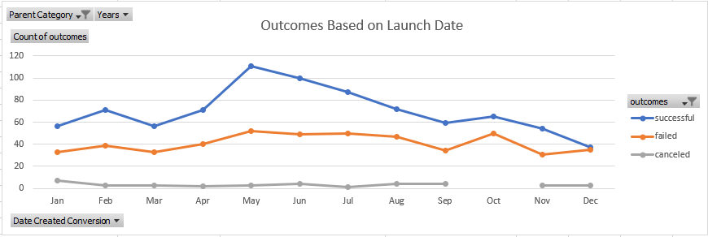
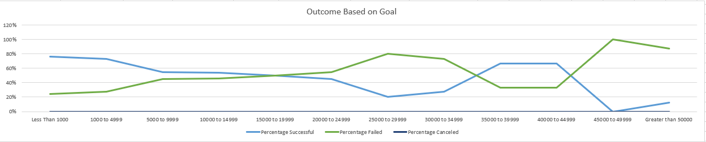

# Kickstarting with Excel

## Overview of Project
This project is comparing campaigns in relation to their launched dates and their funding goals. I will need to analyze the project launched dates against their outcomes as well the outcomes based on their goals. I would need to create formulas (such as countifs and sum to name a few) in order to simplify the data in a way that it remains useful and relevant to the task. The campaign outcomes will be visualized by way of pivot tables and charts. The project will seek to answer the following questions:
1. What data is necessary?
2. What story is being told by the data?
3. What questions can be answered?
4. What trends and patterns can be identified within the data?

### Purpose
The purpose of this analysis is to determine how different campaigns fared in relation to their launch dates and their funding goals.

## Analysis and Challenges
Analysis of this project was performed using the Excel tool to mine, analyze and visualize the data. Two analysis was conducted during this research excercise. They are:
1. Outcomes based on Launch Date
2. Outcomes Based on Goals

### Analysis of Outcomes Based on Launch Date
In order to analyze this segement, the relevant data field were identified from the dataset, i.e outcome (successful, failed and canceled) and time (years and months). I started first by isolating the year `[=YEAR(S2)]` from the "date of creation", once that was done I was able to create a pivot table to show the outcomes over time, as it relates to the parent category "theater".The pivot table was further used to create a pivot chart to visualize the relationship between the outcomes and launch month. Fields used to create the pivot chart are as follow:
1. **Filter:** Parent Category, Years
2. **Rows:** Date, Created Conversion
3. **Columns:** Outcomes
4. **Values:** Count of Outcomes

 **Chart 1 showing outcomes based on launch dates:**

### Analysis of Outcomes Based on Goals
To analyze the outcomes based on goals, target ranges were identified (for example: 0 to 4999). Ten (10) ranges were created of 4,999 intervals, additional goals of less than 1000 and greater than 5000 were also considered. The outcomes (successful, failed and canceled) where then mapped against their goals as well as the subcatergory plays. This was done using the countifs formula; for example: `(=COUNTIFS(Kickstarter!$F:F,"successful",Kickstarter!$D:D,">=35000",Kickstarter!$D:D,"<=39999",Kickstarter!$R:R,"plays")`. 

This formula counts the outcome subcategory within each goal range. Next, would be to calcaulate total of all the projects across each subcategorgy `(=SUM(B2:D2)`. Similarly the percentage of each subcategory was calculated `(=B2/$B$14)`. For visulization, a line chart was used. 

**Chart 2 showing outcomes based on goal:**

### Challenges and Difficulties Encountered
The first (1st) difficulty faced in this challenge was that my charts were not looking like the ones posted in the assignment. I had later realized that my date creation was referencing the incorrect cell for the analysis of based on Launch dates as well I had some computing error with my analysis based on goals. Here I too referenced the wrong cell initially but this time for percentage susscessful. I was incooperating the grand total sum of total projects into my calculations which was wrong. The correct method to do so is to reference the total sum for each outcomes against their goals for example: `(=B2/E2)`

Another difficulty I faced during this excercise was that I was unaware of how to group items within a pivot table; but only after watching the video shown in the tip section of the excercise was I able to do so successfuly. Another challenge faced was computing the goal amount using the formula countifs. I had to make certain cells an abosulte cell reference `(=$C:$C)`, else the cells refernece would continue to change when copying and pasting.I also had to check to make sure that the formula works so I filtered manually to the criteria on the kickstart worksheet. Once I was satisfied that it works, I would copy and paste formula into all relative cell. `=COUNTIFS(Kickstarter!$F:$F,"successful",Kickstarter!$D:$D,">=5000",Kickstarter!$D:$D,"<=9999",Kickstarter!$R:$R,"plays")`

## Results

### What are two conclusions you can draw about the Outcomes based on Launch Date?
>1. The most successful Kickstarter campaigns were started in April, and peaked in May. On the other hand, December doesn't seem like a great time to launch a campaign.

### What can you conclude about the Outcomes based on Goals?
>1. I have found that while there is only a total of 1, 047 Kickstarter campaigns in the sub category "plays", the most successul goal-amount is within the range of Less than 1000 which yields a 76% success rate and range "1000 to 4999" which yields a rate of 73%. Anything above this is proven to be risky and has a high failer rate. However we do have two (2) high ticket items (ranges 35000 to 39999 and 40000 to 44999) with above averages for success (67%) but the number of successful plays in this range are very minuscule and therefore negligible. No plays were cancelled across all range.

### What are some limitations of this dataset?
>Some limitations of this dataset are:
>1. Dataset includes some data points that are not representative of the data we want, For example information regarding funding goals for theather building proposals
>2. We are not working with the complete dataset as it relates to to the category "play". When reviewing outcomes vs goals, we exculded "live" outcomes from the dataset and included "cancelled" outcomes for which there are no data across all ranges within the category "plays". By doing this we reduced the sample size by n19.

### What are some other possible tables and/or graphs that we could create?
>Some possible graphs that could be created are:
>1. **Box Plots:** To compare the distribution of campaign goals and the distribution of total amounts pledged for plays 
>2. **Descriptive Statistics:** To measure the spread of the datasetsuch as looking at the range, standard deviation and variance
>3. **Stacked Columns:**  
